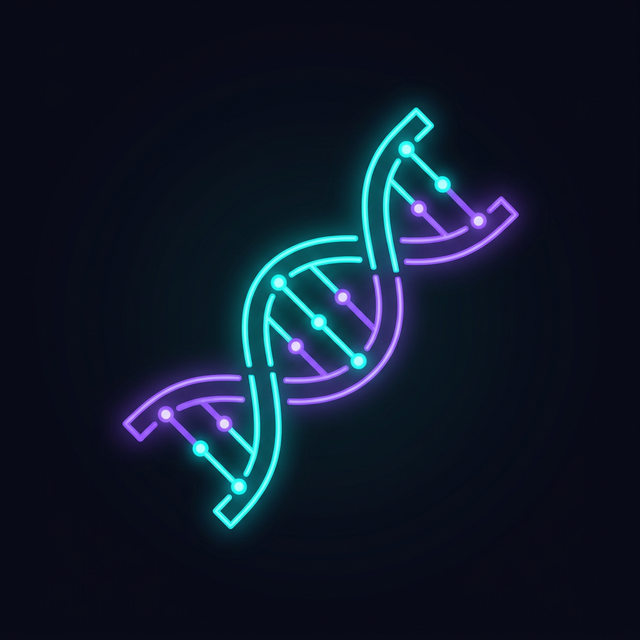

# 🧬 Project DNA — AI Studio Capture Extension

<p align="center">
  
</p>

<p align="center">
  <b>Browser extension that captures Google AI Studio generations into Project DNA knowledge base</b>
</p>

<p align="center">
  
  
  
  
</p>

---

## 📋 Overview

Part of the [AI Design Infrastructure Lab](../README.md) — a production MLOps system for managing AI-generated design assets.

This browser extension automatically **intercepts Google AI Studio API calls** and captures:
- 📝 **Prompt text** (user input)
- ⚙️ **Generation parameters** (temperature, topP, topK, seed, etc.)
- 🤖 **Model information** (gemini-2.0-flash, gemini-pro, etc.)
- 📄 **Generated output** (AI response text)
- 📋 **System instructions** (if configured)

All captured data is automatically sent to the **Project DNA API** for persistent storage in PostgreSQL + Qdrant (vector search).

---

## 🏗️ Architecture

```
┌─────────────────────────────────────────────────────────────────┐
│  Browser Tab: aistudio.google.com                               │
│                                                                  │
│  ┌─── Page JavaScript Context ─────────────────────────────┐   │
│  │  Google AI Studio App                                    │   │
│  │  └── fetch("generativelanguage.googleapis.com/...")       │   │
│  │        ↓ (monkey-patched by our interceptor)             │   │
│  │  page-script.js (injected)                               │   │
│  │  ├── Clones request body (prompt, params)                │   │
│  │  ├── Clones response body (generated text)               │   │
│  │  └── Posts via window.postMessage                         │   │
│  └──────────────────────────────┬──────────────────────────┘   │
│                                 │                               │
│  ┌─── Extension Context ────────▼──────────────────────────┐   │
│  │  content-script.js (bridge)                              │   │
│  │  ├── Validates message origin (security)                 │   │
│  │  └── Forwards to service worker via chrome.runtime       │   │
│  └──────────────────────────────┬──────────────────────────┘   │
└─────────────────────────────────┼───────────────────────────────┘
                                  │
┌─────────────────────────────────▼───────────────────────────────┐
│  Service Worker (background)                                     │
│  ├── Transforms data to Project DNA API format                   │
│  ├── POST /v1/dna/capture → AI Router (FastAPI)                 │
│  ├── Queue + retry for failed captures (outbox pattern)         │
│  └── chrome.storage for persistent state                        │
└─────────────────────────────────┬───────────────────────────────┘
                                  │ HTTP (fetch)
┌─────────────────────────────────▼───────────────────────────────┐
│  Project DNA API (FastAPI + Uvicorn)                            │
│  ├── PostgreSQL (prompt text, parameters, metadata)             │
│  ├── Qdrant (vector embedding for semantic search)              │
│  └── Auto-Summarize (background context compression via LLM)   │
└─────────────────────────────────────────────────────────────────┘
```

### Key Design Decisions

| Decision | Rationale |
|----------|-----------|
| **Fetch monkey-patching** | Content scripts can't access page's `fetch` due to isolated worlds. Injecting a page-level script is the only reliable interception method |
| **Outbox pattern** | Failed API calls are queued in `chrome.storage.local` and retried later, ensuring zero data loss even when the server is offline |
| **ES Modules in service worker** | Manifest V3 supports `"type": "module"` in Chrome 91+ and Safari 16.4+, enabling cleaner code organization |
| **Manifest V3** | Required for Safari Web Extensions and future-proof for Chrome (MV2 deprecated) |

---

## 📁 Project Structure

```
project-dna-extension/
├── manifest.json                    # Extension manifest (MV3)
├── .gitignore
├── README.md                        # This file
│
├── icons/                           # Extension icons (16, 48, 128px)
│   ├── dna-16.png
│   ├── dna-48.png
│   └── dna-128.png
│
└── src/
    ├── background/
    │   └── service-worker.js        # Central message router + API client
    │                                #   - Receives captures from content script
    │                                #   - Sends to Project DNA API
    │                                #   - Manages state (chrome.storage)
    │                                #   - Capture queue with retry logic
    │
    ├── content/
    │   ├── content-script.js        # Bridge: page ↔ extension
    │   │                            #   - Injects page-script.js
    │   │                            #   - Routes messages between worlds
    │   │
    │   └── page-script.js           # Fetch interceptor (page context)
    │                                #   - Monkey-patches window.fetch
    │                                #   - Extracts prompt, params, output
    │                                #   - Handles streaming (SSE) responses
    │
    └── popup/
        ├── popup.html               # Extension popup UI
        ├── popup.css                # Premium dark theme (glassmorphism)
        └── popup.js                 # Popup logic + API communication
```

---

## 🚀 Installation

### Chrome / Edge (Development Mode)

1. Clone this repository:
   ```bash
   git clone https://github.com/YOUR_USERNAME/project-dna-extension.git
   ```

2. Open Chrome and navigate to `chrome://extensions/`

3. Enable **Developer mode** (toggle in top-right corner)

4. Click **Load unpacked** and select the `project-dna-extension/` directory

5. The extension icon (🧬) appears in the toolbar

### Safari (macOS)

1. Install Xcode (if not already installed)

2. Convert the web extension to a Safari extension:
   ```bash
   xcrun safari-web-extension-converter project-dna-extension/ \
     --project-location ./safari-xcode \
     --app-name "Project DNA Capture" \
     --bundle-identifier com.projectdna.capture
   ```

3. Open the generated Xcode project and build

4. Enable in Safari → Preferences → Extensions

---

## ⚙️ Configuration

1. Click the extension icon in the toolbar
2. Set the **API URL** (default: `http://172.25.9.33:8000`)
3. Select the **active project** from the dropdown
4. Toggle **Auto-Capture** on

---

## 🔌 API Integration

The extension sends captured data to:

```
POST /v1/dna/capture
```

**Request body:**
```json
{
  "project_slug": "my-design-project",
  "prompt_text": "Create a futuristic dashboard with neon accents...",
  "model_name": "gemini-2.0-flash",
  "parameters": {
    "temperature": 0.7,
    "topP": 0.95,
    "topK": 64,
    "maxOutputTokens": 8192
  },
  "output_text": "Here is a futuristic dashboard design...",
  "system_instruction": "You are a UI/UX design expert...",
  "source": "ai-studio-extension",
  "metadata": {
    "sourceUrl": "https://aistudio.google.com/app/prompts/...",
    "finishReason": "STOP",
    "capturedAt": "2026-03-12T00:19:00.000Z"
  }
}
```

---

## 🛡️ Security

- **Origin validation**: Content script only accepts messages from `https://aistudio.google.com`
- **No data modification**: The interceptor is read-only — AI Studio requests/responses pass through unchanged
- **Local storage only**: Credentials and API URLs stored in `chrome.storage.local` (extension-private)
- **No external analytics**: Zero tracking, zero telemetry
- **Minimal permissions**: Only `storage`, `activeTab`, and host permissions for AI Studio + API server

---

## 🧪 Development

### Debugging

1. **Service Worker logs**: `chrome://extensions/` → Click "Service Worker" link
2. **Content Script logs**: Open DevTools (F12) on AI Studio page → Console
3. **Popup logs**: Right-click extension icon → "Inspect Popup"

### Testing the Interceptor

1. Open `https://aistudio.google.com`
2. Enter a prompt and click "Run"
3. Check the browser console for `[Project DNA] 🧬` log messages
4. Open the extension popup to see the capture in "Recent Captures"

---

## 📊 Tech Stack

| Component | Technology |
|-----------|-----------|
| Extension API | Web Extensions API (Manifest V3) |
| Background | Service Worker (ES Modules) |
| Interception | Fetch monkey-patching + postMessage bridge |
| UI | Vanilla HTML/CSS/JS (premium dark theme) |
| Storage | chrome.storage.local |
| Backend API | FastAPI + PostgreSQL + Qdrant |
| Resilience | Outbox pattern (queue + retry) |

---

## 📄 License

MIT License — see [LICENSE](LICENSE) for details.

---

<p align="center">
  <sub>Part of <b>AI Design Infrastructure Lab</b> — MLOps Portfolio Project</sub>
</p>
